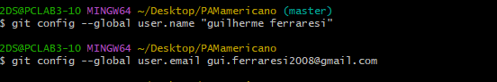
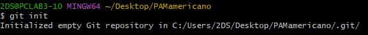
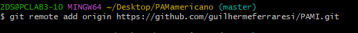
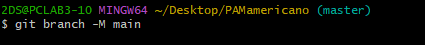
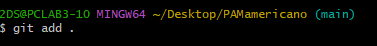
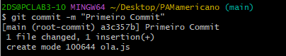
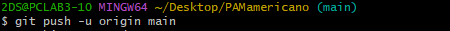
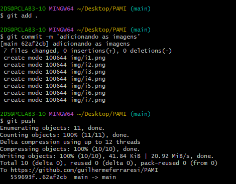

Esses dois comandos servem para logar o git com a sua conta no git hub.

Inicializa o git na sua pasta.

Linka a sua pasta com o repositório que você criou.

Muda de "Master" para "Main".

Adiciona os arquivos alterados para ser feito o commit

Especifica as alterações feitas no arquivo auxiliando no versionamento.

Sobe o commit para o repositório do git hub.

Sincronizando as alterações no git hub

